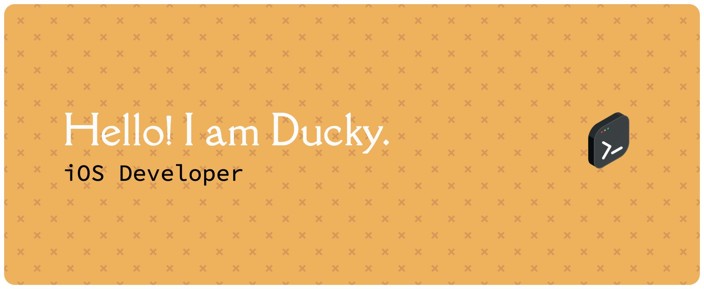

## 💫 About Me:
🔭 I’m working on the "Meal Seeker" iOS app.
👯 Currently learning Swift and SwiftUI with Xcode.  
🤝 I have 12+ years of experience in web, iOS, and Android app testing as a QA.  
⚡ Fun fact: I used to work as a designer.

## 🌐 Socials:
  

## 💻 My Skills:

:small_orange_diamond: HTML, CSS, Bash, Firebase, npm, Jenkins, MongoDB, Figma, Git, Github,
Postman, Sentry, VS Code

- iOS Dev: Swift, SwiftUI, Xcode, Networking (REST APIs), SwiftData/Core Data   
- QA Transferables: Swift testing/XCTest unit/integration testing, Agile/Scrum, Bug tracking (e.g., Jira)  
- Other: Git, Figma, Canva, Basic UI/UX from design background

### 📊 GitHub Stats:

 ## :inbox_tray: Let's Connect!
 Open to Junior iOS developer roles in the UK. Please feel free to reach out via Email or LinkedIn for a chat or Swift projects.

 

<!-- Proudly created with GPRM ( https://gprm.itsvg.in ) -->
